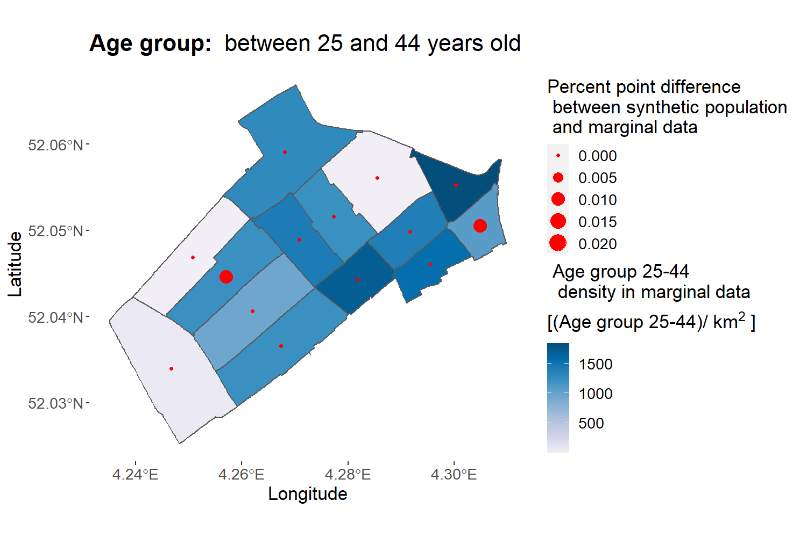
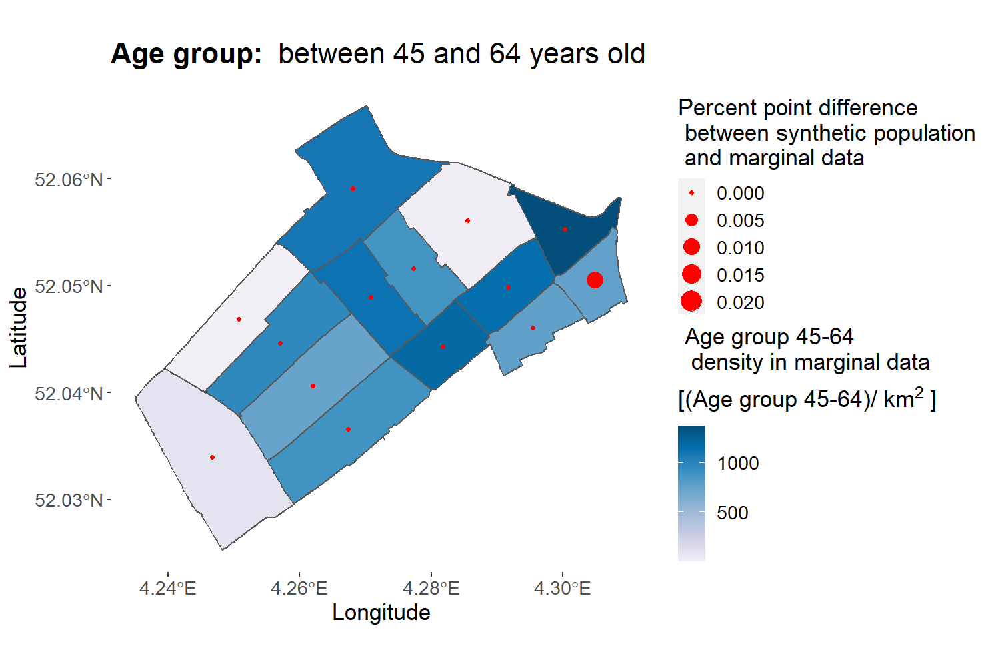
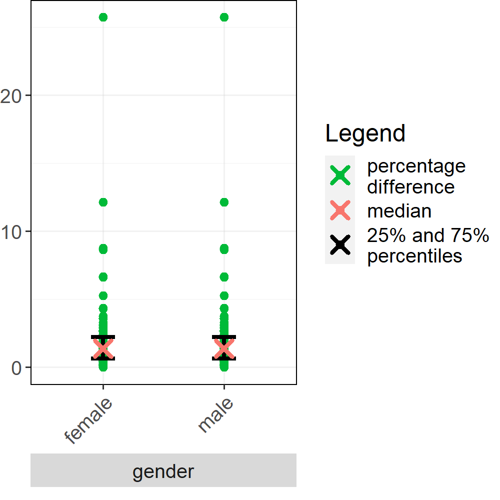
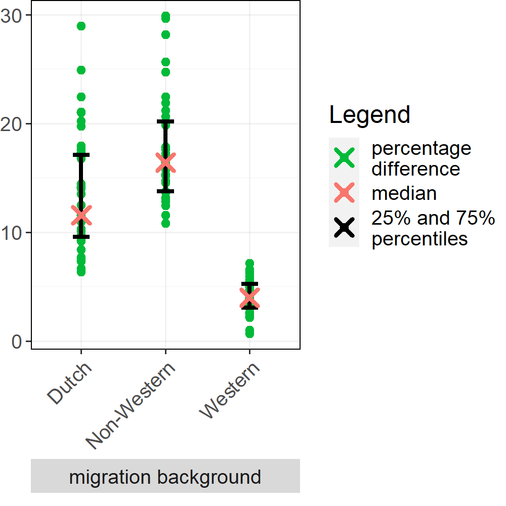
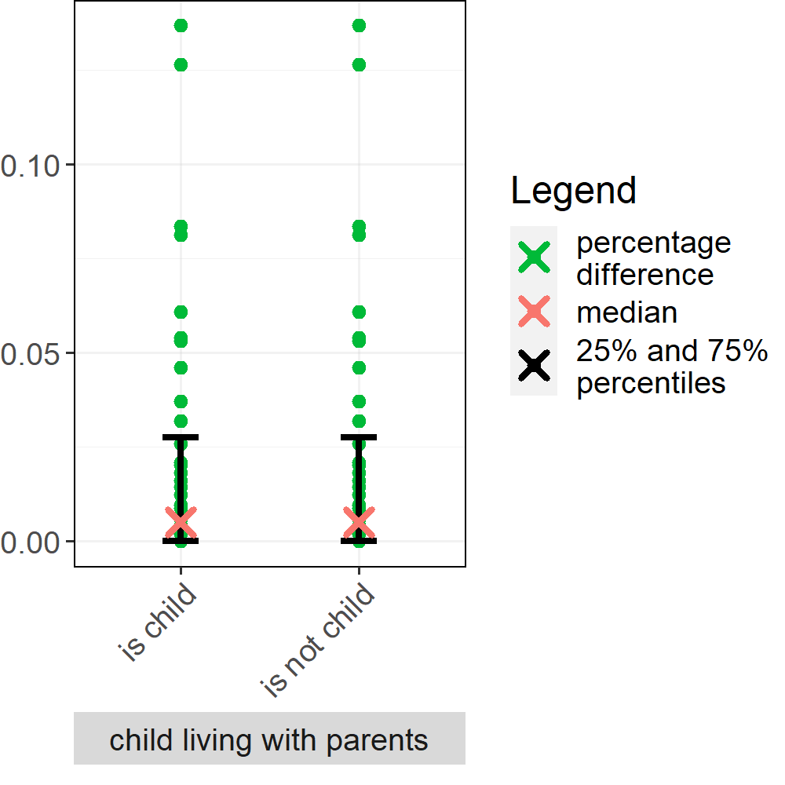
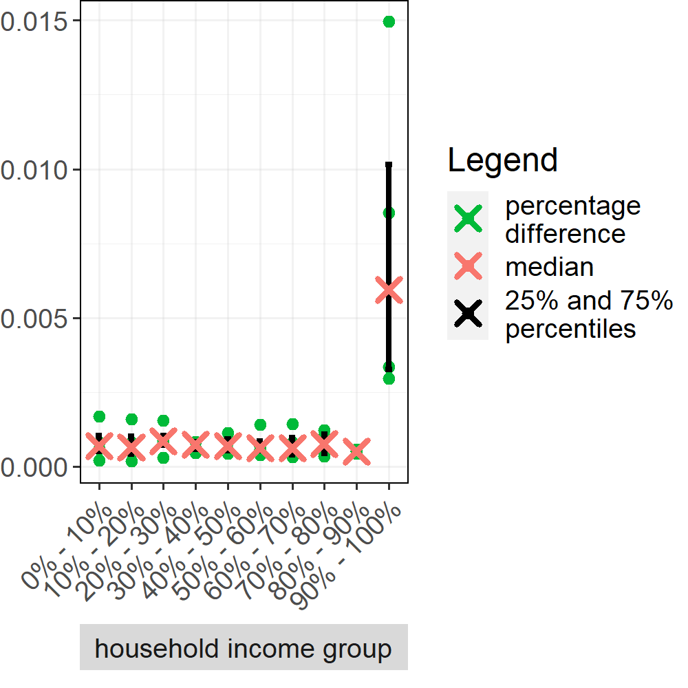
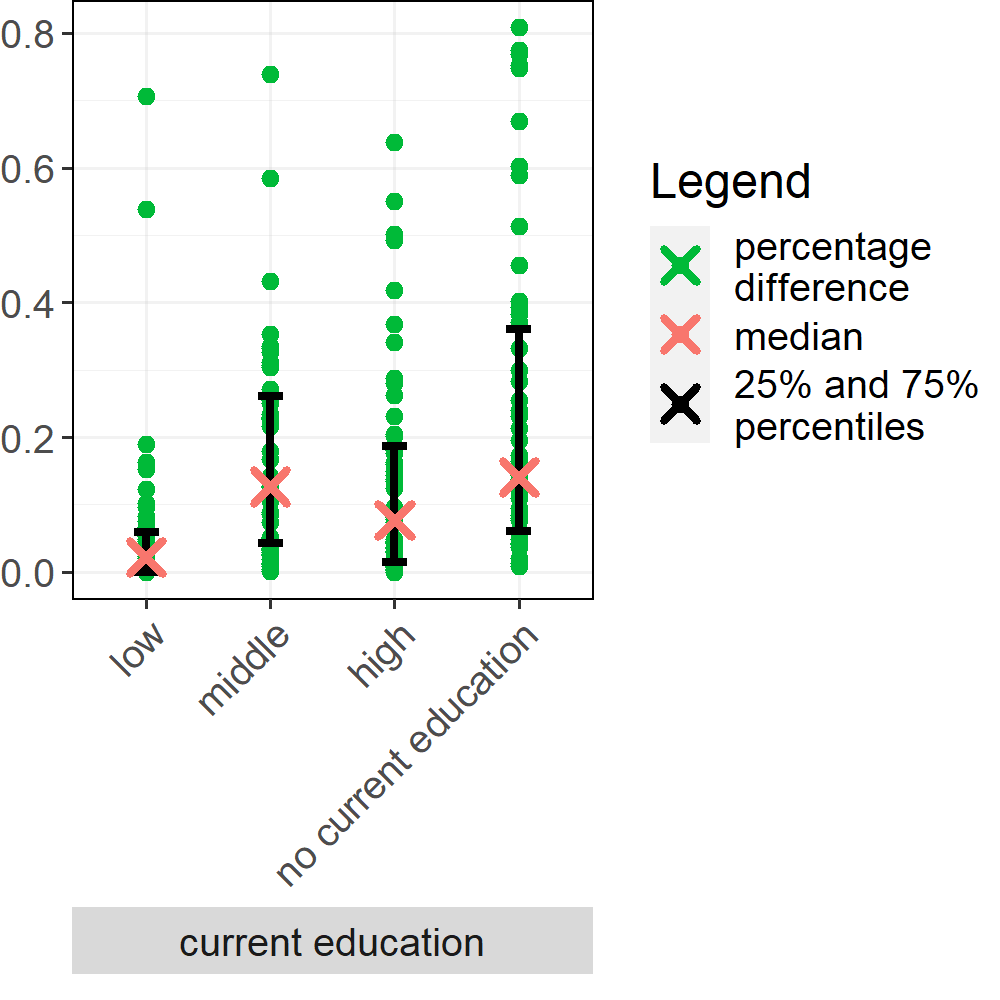

## Generating a Spatially Explicit Synthetic Population of Individuals and Households

## Evaluation plots

#### _Utrecht University, The Netherlands. 2022 - 2023_

#### _Author: Marco Pellegrino_

#### _Contribution: Jan de Mooij, Tabea Sonnenschein, Mehdi Dastani, Dick Ettema, Brian Logan, Judith A. Verstegen_

Sections:

*   [Comparison with neighbourhood marginal data set](#comparison-with-neighbourhood-marginal-data-set)
*   [Spatially-detailed comparison with neighbourhood marginal data set](#spatially-detailed-comparison-with-neighbourhood-marginal-data-set)
*   [Comparison with jointly distributed data sets](#comparison-with-jointly-distributed-data-sets)

## Comparison with neighbourhood marginal data set

## Spatially-detailed comparison with neighbourhood marginal data set

#### Age groups

|  |  |  |

|  |  |

#### Gender

|  |  |

#### Migration background

|  |  |  |

#### Education attainment

|  |  |  |

#### Household type

|  |  |  |

## Comparison with jointly distributed data sets

|  |  |
|  |  |
|  |  |
|  |  |