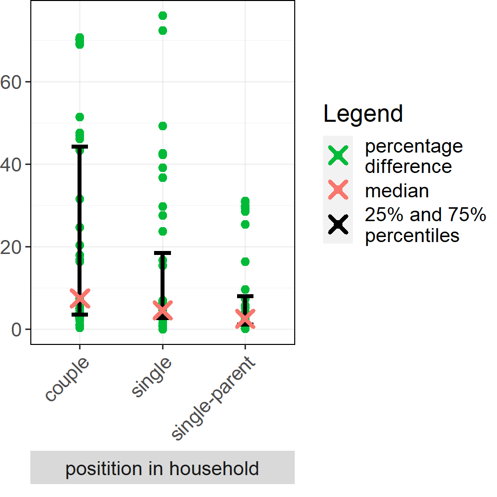

# Generating a Spatially Explicit Synthetic Population of Individuals and Households

## Evaluation plots

#### *Utrecht University, The Netherlands. 2022 - 2023*

#### *Author: Marco Pellegrino*

#### *Contribution: Jan de Mooij, Tabea Sonnenschein, Mehdi Dastani, Dick Ettema, Brian Logan, Judith A. Verstegen*

## Comparison with neighbourhood marginal data set

## Comparison with jointly distributed data sets

|                                                                |                                                                   |
|------------------------------------------------------|------------------|
|              |              |
|             |           |
|       |  |
|  |      |
